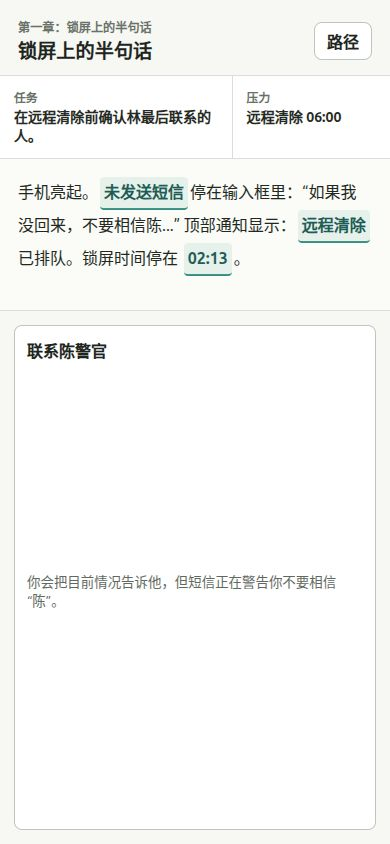
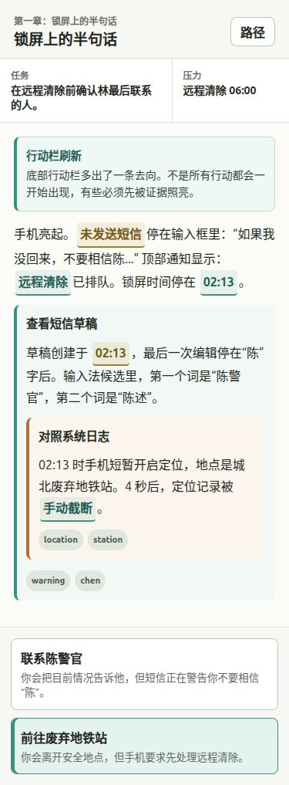
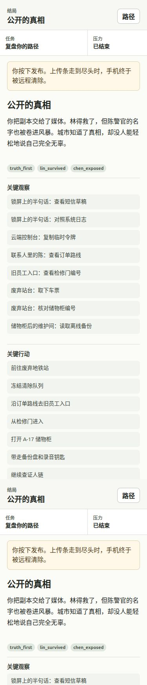

# Game Writer

竖屏文字冒险游戏与 AI 辅助创作流水线的 V0 工程仓库。

当前项目不是“AI 实时随机写剧情”，而是一个确定性叙事结构实验：玩家在手机竖屏界面中阅读场景、展开隐藏观察、解锁行动、承担后果，并在章节复盘和结局画像里看到世界如何记住自己。

产品准则以 `/home/samsong/Desktop/game_writer/doc/prd` 为准；执行项目时先读 `/home/samsong/Desktop/game_writer/agent.md`。

## Experience

首屏是一个竖屏手机阅读界面，核心由场景文字、observe anchor 和底部 choice 组成。



观察不是补充说明，而是会改写玩家理解、写入隐藏状态，并在证据足够时长出新的行动。



章节结束后会进入复盘：展示已走路径、关键行动、状态回声，以及未解锁分支缺少的证据。


结局页不是只显示一个结论，而是回看关键观察、关键行动、最终立场和结局标签。



## Current Slice

- 玩家端：`index.html`、`src/app.js`、`src/styles.css`
- Demo 内容：`generated/missing_phone_v0/game.json`
- 生成器：`scripts/generate_game.py`
- Schema：`schemas/game.schema.json`
- 校验器：`scripts/validate_game.py`
- 内容 QA：`scripts/content_qa_report.py`
- 浏览器 smoke：`scripts/browser_smoke.py`
- 多结局 E2E：`scripts/browser_e2e_matrix.py`
- 遗漏路径 E2E：`scripts/browser_omission_paths.py`
- 存档合同：`examples/fixtures/save_contract/save_cases.json`
- 存档合同回放：`scripts/browser_save_contract.py`
- 可访问性 smoke：`scripts/browser_a11y_smoke.py`
- 内部测试模板：`doc/testing/internal_playtest_record_template.md`

当前 demo 已覆盖：

- 3 章 x 每章 3 个主场景，共 9 个主场景。
- 最多三层嵌套 observe。
- observe 写入隐藏状态并解锁 choice。
- choice 写入状态并进入后续章节或结局。
- 第一章叙事内轻教学和新行动高亮。
- 章节结束 flowchart 复盘、未解锁原因、路径图、结局行动画像。
- 隐藏关系变量在后续场景触发叙事回声。
- 本地刷新恢复、v1 存档迁移、坏存档 fallback 和恢复提示。
- 三条主结局浏览器路径：`ending_publish`、`ending_bury`、`ending_confront`。
- 遗漏关键观察时，行动保持隐藏，章节复盘解释缺少哪条证据。

## Quick Start

生成 deterministic demo：

```bash
python3 scripts/generate_game.py \
  --brief examples/briefs/missing_phone.json \
  --out generated/missing_phone_v0 \
  --provider offline
```

启动本地静态服务：

```bash
python3 -m http.server 4173
```

打开：

```text
http://127.0.0.1:4173/
```

## Verification

推荐提交前跑：

```bash
python3 scripts/validate_json_schema.py generated/missing_phone_v0/game.json
python3 scripts/validate_game.py generated/missing_phone_v0/game.json
python3 scripts/content_qa_report.py generated/missing_phone_v0/game.json
python3 scripts/smoke_playthrough.py generated/missing_phone_v0/game.json
python3 scripts/validate_save_contract.py
python3 scripts/browser_smoke.py
python3 scripts/browser_save_contract.py
python3 scripts/browser_a11y_smoke.py
python3 scripts/browser_omission_paths.py
python3 scripts/browser_e2e_matrix.py
python3 -m unittest discover -s tests -v
```

可选修复检查：

```bash
python3 scripts/repair_game.py generated/missing_phone_v0/game.json --out /tmp/repaired_game.json
```

## AI Pipeline

当前 AI Agent 路线仍是辅助创作，不是全自动作者。仓库里已经有：

- 图式生成 Agent：`scripts/run_generation_agent.py`
- Prompt manifest：`prompts/manifest.json`
- 生成 trace：`generated/missing_phone_v0/generation_trace.jsonl`
- 生成失败 fixture：`examples/fixtures/generation_failures/fixture_cases.json`
- 模型输出样本归档：`scripts/archive_model_output_sample.py`
- 模型输出样本校验：`scripts/validate_model_output_archive.py`

运行图式生成 Agent：

```bash
python3 scripts/run_generation_agent.py \
  --brief examples/briefs/missing_phone.json \
  --out generated/missing_phone_agent_v0 \
  --provider offline
```

该入口会执行 `load_brief -> draft_skeleton -> optional_llm_polish -> validate_schema -> validate_structure -> validate_content_qa -> repair_if_needed -> export_artifacts -> write_agent_trace`，并导出 `agent_trace.jsonl`。

归档真实模型输出样本：

```bash
python3 scripts/archive_model_output_sample.py \
  --input path/to/raw_model_output.txt \
  --sample-id first_scene_polish_fail_001 \
  --provider openai_compatible \
  --model your-model-id \
  --source first_scene_llm_polish_v0_1 \
  --notes "invalid JSON returned by optional polish"
```

校验样本库：

```bash
python3 scripts/validate_model_output_archive.py
```

## Product Boundary

当前状态是：

```text
中等长度可运行工程纵切 / medium-length playable vertical slice
```

还不是：

```text
可发布 MVP / shippable MVP
```

仍缺少真实 5 到 8 人 playtest、真实移动设备验收、多浏览器验收、屏幕阅读器质量验证、真实 LLM 输出样本库，以及更强的语义内容 QA。

## Iteration Rule

每次有意义的迭代都要写入 `/home/samsong/Desktop/game_writer/log`，时间戳保留到毫秒。

更新 PRD 或技术文档前，先把旧版快照归档到 `/home/samsong/Desktop/game_writer/doc/prd/old version`。
