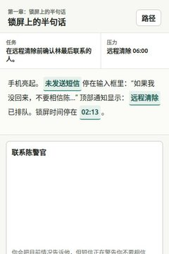
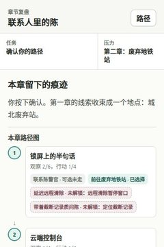
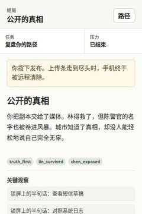
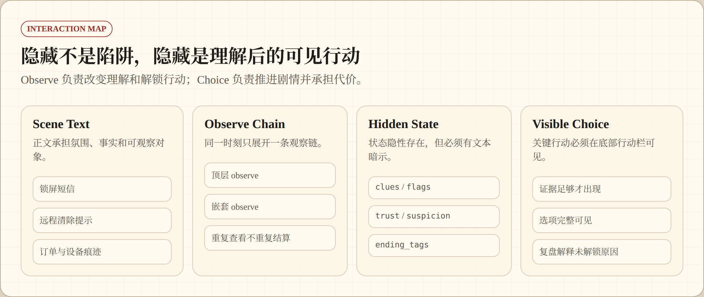
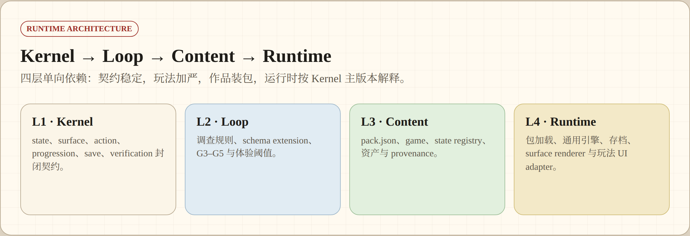
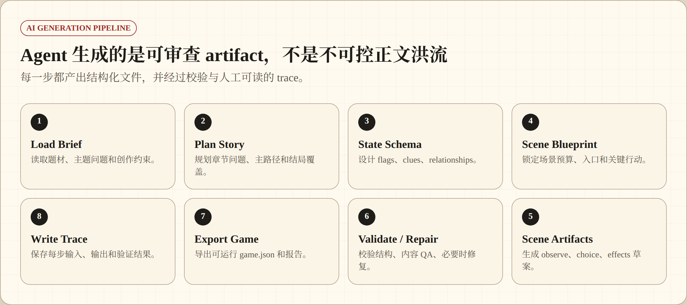
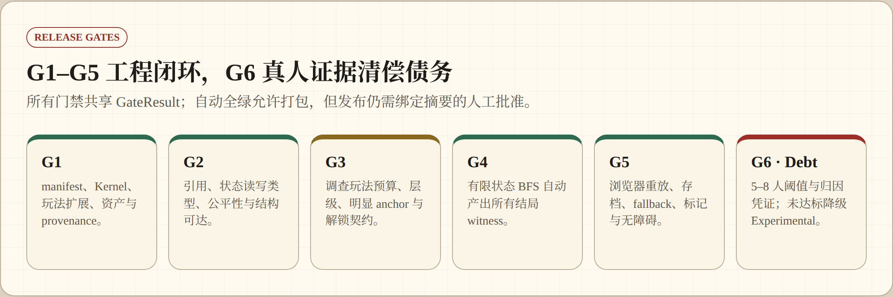
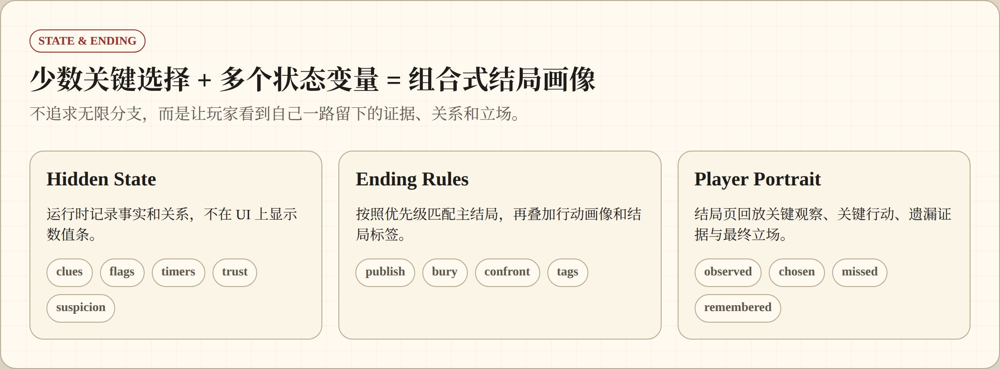
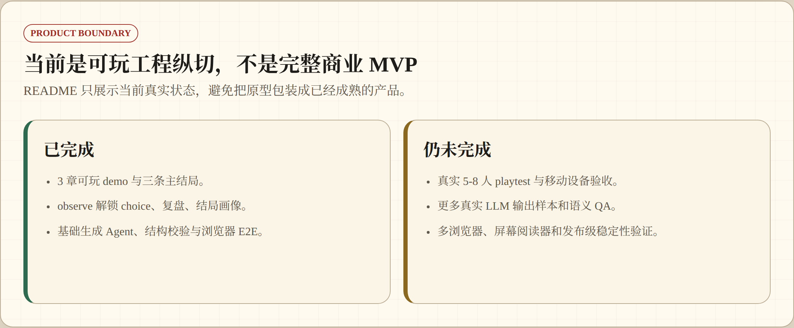

# Narrative Trace

竖屏文字冒险游戏与 AI 辅助创作管线。

<table>
  <tr>
    <td width="50%">
      <strong>在线体验</strong><br>
      <a href="https://wzxsph.github.io/Narrative-Trace/">打开《失踪者的手机》GitHub Pages Demo</a>
    </td>
    <td width="50%">
      <strong>当前状态</strong><br>
      <code>Framework V1 · G1–G5 engineering complete</code>
    </td>
  </tr>
</table>

备用 Cloudflare Worker Demo：<https://game-writer-missing-phone.samsong-1a3.workers.dev/>

这个项目不是“AI 实时随机写剧情”，而是一个确定性互动叙事实验：玩家在有限信息里观察、判断、行动，系统用隐藏状态记住选择，并在章节复盘和结局画像里回放玩家留下的痕迹。

## Experience

<table>
  <tr>
    <td align="center" width="25%">
      <a href="screenshots/01-start-screen.jpg"></a>
      <br>
      <sub>Start</sub>
    </td>
    <td align="center" width="25%">
      <a href="screenshots/02-observe-unlocks-choice.jpg"></a>
      <br>
      <sub>Observe unlock</sub>
    </td>
    <td align="center" width="25%">
      <a href="screenshots/03-chapter-review-flow.jpg"></a>
      <br>
      <sub>Chapter review</sub>
    </td>
    <td align="center" width="25%">
      <a href="screenshots/04-ending-portrait.jpg"></a>
      <br>
      <sub>Ending portrait</sub>
    </td>
  </tr>
</table>

## Game Loop

<p align="center">
  
</p>

核心规则很简单：正文可以滚动阅读，底部选项应完整可见；隐藏内容不做关键点击陷阱，而是通过 observe 解锁新的可见 choice。

## Interaction Map

<p align="center">
  
</p>

## Runtime Architecture

Framework V1 将工程拆为四层：L1 Kernel 契约、L2 玩法包、L3 内容包、L4 运行时。`pack.json` 是作品入口；运行时内部只消费 V1，调查玩法包当前为 `Verified (verification debt)`，不在真人 G6 数据完成前宣称债务已清偿。

<p align="center">
  
</p>

## AI Generation Pipeline

当前 Agent 是创作辅助流水线，不是全自动作者。它把主题 brief 编译成结构化 artifact，再经过校验、审查和发布闸门生成可玩的 `game.json`。

<p align="center">
  
</p>

## Release Gates

<p align="center">
  
</p>

## State & Ending

<p align="center">
  
</p>

图源位于 `doc/readme_diagrams/readme_diagrams.html`，重新生成 README 流程图：

```bash
python3 scripts/render_readme_diagrams.py
```

## Quick Start

```bash
python3 -m http.server 4173
```

打开：

```text
http://127.0.0.1:4173/
```

验证当前内容包（G5 会启动无头浏览器）：

```bash
python3 scripts/validate_pack.py content_packs/missing_phone/v1 --through G5
```

旧生成 CLI 在 V1.0 仍保留为只读兼容入口；新的分阶段 Agent 命令见 `--help`：

```bash
python3 scripts/run_generation_agent.py \
  --brief examples/briefs/missing_phone.json \
  --out content_packs/generated_story/v1 \
  --provider offline
```

构建静态站点或 Cloudflare Worker（必须明确选择一个内容包；命令只构建，不自动部署）：

```bash
python3 scripts/build_static_bundle.py \
  --pack content_packs/missing_phone/v1 \
  --output dist/game-worker

scripts/build_game_worker_bundle.sh \
  --pack content_packs/missing_phone/v1
```

## Project Map

<table>
  <tr>
    <th align="left">Area</th>
    <th align="left">Files</th>
  </tr>
  <tr>
    <td>玩家端</td>
    <td><code>index.html</code>, <code>runtime-config.json</code>, <code>src/runtime/*</code>, <code>src/styles.css</code></td>
  </tr>
  <tr>
    <td>L1 Kernel</td>
    <td><code>schemas/kernel/v1/*</code></td>
  </tr>
  <tr>
    <td>L2 调查玩法包</td>
    <td><code>loop_packages/investigation/v1/*</code></td>
  </tr>
  <tr>
    <td>L3 Demo 内容包</td>
    <td><code>content_packs/missing_phone/v1/*</code></td>
  </tr>
  <tr>
    <td>生成管线</td>
    <td><code>scripts/run_generation_agent.py</code>, <code>gamegen/*</code>, <code>prompts/manifest.json</code></td>
  </tr>
  <tr>
    <td>统一门禁</td>
    <td><code>gamegen/gates.py</code>, <code>gamegen/g5.py</code>, <code>scripts/validate_pack.py</code></td>
  </tr>
  <tr>
    <td>浏览器验证</td>
    <td><code>scripts/browser_smoke.py</code>, <code>scripts/browser_e2e_matrix.py</code>, <code>scripts/browser_a11y_smoke.py</code></td>
  </tr>
</table>

<details>
  <summary><strong>Full Verification Commands</strong></summary>

```bash
python3 scripts/validate_pack.py content_packs/missing_phone/v1 --through G5
python3 scripts/validate_json_schema.py generated/missing_phone_v0/game.json
python3 scripts/validate_game.py generated/missing_phone_v0/game.json
python3 scripts/content_qa_report.py generated/missing_phone_v0/game.json
python3 scripts/smoke_playthrough.py generated/missing_phone_v0/game.json
python3 scripts/validate_save_contract.py
python3 scripts/browser_smoke.py
python3 scripts/browser_save_contract.py
python3 scripts/browser_a11y_smoke.py
python3 scripts/browser_omission_paths.py
python3 scripts/browser_e2e_matrix.py
python3 -m unittest discover -s tests -v
```

</details>

<details>
  <summary><strong>LLM / Artifact Checks</strong></summary>

```bash
python3 scripts/llm_env_smoke_test.py
python3 scripts/llm_scene_review_smoke.py
python3 scripts/validate_state_schema_design.py generated/missing_phone_agent_v0/state_schema_design.json
python3 scripts/validate_scene_blueprint.py generated/missing_phone_agent_v0/scene_blueprint.json
python3 scripts/validate_scene_artifacts.py generated/missing_phone_agent_v0/scene_artifacts.json
python3 scripts/validate_blueprint_alignment.py generated/missing_phone_agent_v0/game.json
python3 scripts/validate_model_output_archive.py
```

</details>

## Product Boundary

<p align="center">
  
</p>

产品准则以 <code>doc/prd</code> 为准；Agent 执行规则见 <code>agent.md</code>。

Framework V1 契约定义与实施落点见 `doc/framework/FRAMEWORK_V1_互动叙事框架定义.md` 和 `doc/framework/FRAMEWORK_V1_实施设计.md`。`generated/missing_phone_v0`、旧 URL、旧 CLI 与旧存档迁移在 V1.0 保留；兼容层移除不早于另行批准的 V1.1。
